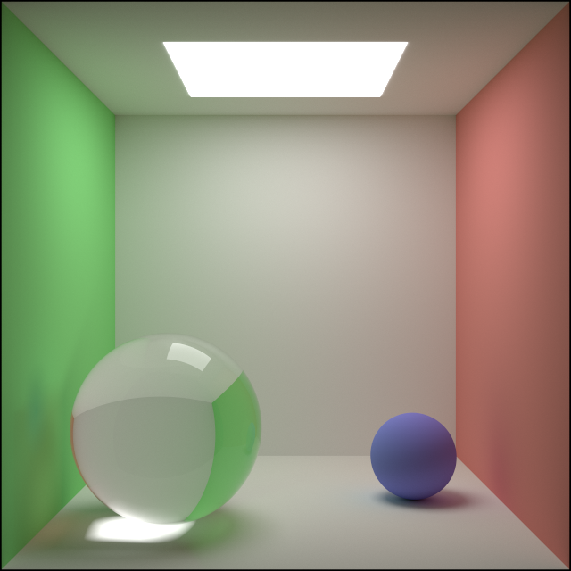

# DevilRay

Welcome to my personal hobby project where I embark on a journey to better understand how Physically Based Rendering (PBR) works.

You can follow along my steps on [my blog](https://komaro.me/) if you wish.

This contains a rendering tool that can run on the GPU and create realistic images of various scenes such as this:

## How to build

1. Create a venv
2. Install python dependencies
3. conan install . --build=missing
4. cmake --preset conan-release
5. cmake --build --preset conan-release
6. build/Release/renderer/devil_ray_renderer

## Disclaimer

I use AI tools for multiple purposes throughout this project:

1. **Idea discovery**: When I face a problem I'm not knowledgeable in, I sometimes ask an AI assistant about the established algorithms and where to find more information about them.
2. **Tests**: Tests are super important to ensure the whole project doesn't go crumbling down when I update any part of it. However, my goal with this project is to learn about algorithms and math, so I use AI code generation often to write tests.

I review and fix all AI-generated code before committing it, which seems to be essential, given the glaring mistakes even the best models tend to make every now and then.

What I **DO NOT** use AI for is writing the actual algorithms in question, since that would defeat the purpose of my endeavor.

All AI-generated code is marked with a disclaimer on top of their respective files.