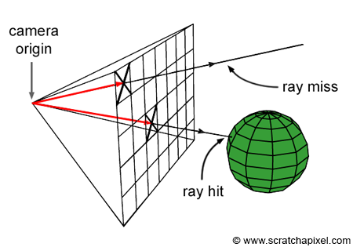
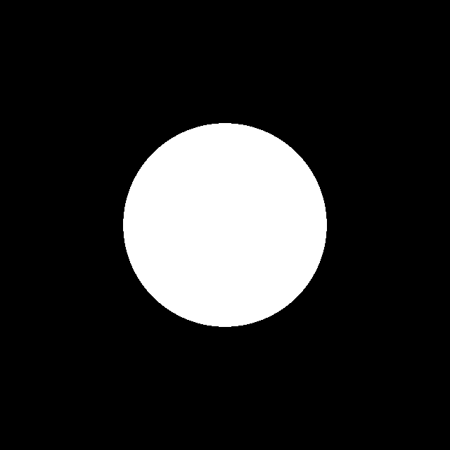

# Ray tracing from ground up

I absolutely love computer graphics and since many years I have been dreaming of working on something with it.

Well that time is now, I decided to build a ray tracing renderer from the ground up.

I will document my journey here, loosely, making a post when I feel like it.

There are many excellent tutorials that do a great job at explaining the foundations and ray tracing and photorealistic rendering, therefore I will not attempt to be thorough on every such detail, but I'll rather link to resources I used.

I will be using C++20, Cmake and manage dependencies with Conan. The code should work on any common operating system.

## CPU ray tracing

My first goal is to be able to render a version of the [Cornell Box](https://en.wikipedia.org/wiki/Cornell_box) using the CPU.

The plan is simple, I define a camera, generate rays from each pixel, test if the rays intersect the scene.


Illustration courtesy of Scratch a Pixel ([link](https://www.scratchapixel.com/lessons/3d-basic-rendering/ray-tracing-overview/ray-tracing-rendering-technique-overview.html)).

### Helper classes

I created basic linear algebra classes such as 2D and 3D vectors to be able to describe other constructs more concisely. For details check out the source code.

### Ray

To represent a ray of light I need to know its current position and direction of travel.

```C++
struct Ray
{
    Vec3 p;
    Vec3 v;
};
```

### Camera

The camera is characterized by its resolution, physical pixels size and a simple pinhole calibration model.

Let's start with the intrinsics:
```C++
struct Intrinsics
{
    float focal_length;
    Vec2 center;
};
```

And use it to define the camera:
```C++
struct Camera {
    Intrinsics intrinsics;
    Size2i resolution;
    Size2f physical_pixel_size;
};
```

With this in hand we can generate rays going out from the camera:
```C++
Ray cameraRay(const Camera &cam, Vec2 pixelCoord)
{
    const auto pixelCenter = pixelCoord + Vec2{0.5, 0.5};
    const auto physicalPixelCenter = pixelCenter * cam.physical_pixel_size - cam.intrinsics.center;

    const auto dir = physicalPixelCenter / cam.intrinsics.focal_length;
    
    return Ray{
        .p = Vec3{0,0,0},
        .v = Vec3{dir.x, dir.y, 1}
    };
}
```

### Objects

I can now send out rays, but there's nothing that those rays could hit.

Let's add a simple primitive:
```C++
struct Sphere
{
    Vec3 center;
    float radius;
};
```

The sphere is characterized by its center and radius. 

### Intersection

To encode information about a ray hitting a surface, I created an intersection class:
```C++
struct Intersection
{
    float t;
    Vec3 p;
};
```

For now it only stores how far the ray has to travel to hit the surface and the physical point where the hit occurs. Later I will add more information to this class.

Now I need to be able to test if one of my rays intersects a sphere. Instead of duplicating existing work I will just link to [Scratch a Pixel](https://www.scratchapixel.com/lessons/3d-basic-rendering/minimal-ray-tracer-rendering-simple-shapes/ray-sphere-intersection.html) on how to find the intersection.

The interface to the intersection test functions:
```C++
std::optional<Intersection> getIntersection(const Ray &ray, const Sphere &sphere);
```

It returns `std::nullopt` if the ray misses all objects.

Later when I have more kinds of objects I plan to store them in an `std::variant`, thus avoiding virtual functions. I expect this to be useful when I implement a CUDA backend.

### Rendering

With all the above building blocks we are ready to render our first image.
Let's simply create a camera with `14mm` focal length, `14.9um` pixel size and a modest `640x640` resolution.

Let's also create a sphere we can test against:
```C++
const auto s = Sphere{
    .center = Vec3{0, 0, 2},
    .radius = 300e-3,
};
```

The actual rendering is then an iteration over all pixels, casting a ray from that pixel using the camera and testing if it intersects the sphere.

```C++
for (int y=0;y<resolution.width;++y)
{
    for (int x=0;x<resolution.width;++x)
    {
        const auto ray = cameraRay(camera, Vec2{x, y});
        const auto intersection = getIntersection(ray, s);

        if (intersection.has_value())
        {
            setPixel(x, y, Color::WHITE);
        }
        else
        {
            setPixel(x, y, Color::BLACK);
        }
    }
}
```

Note that I omitted the image creation and pixel setting code. I used a plain array of 4 byte integers to store RGBA values, then saved them into a PNG at the end using [stb_image](https://github.com/nothings/stb).

### The result

Our first ray traced sphere!



I got to cast rays from a virtual camera and test if they intersect a sphere. I am thrilled to continue this journey, next I will probably add more primitives and UV coordinates.