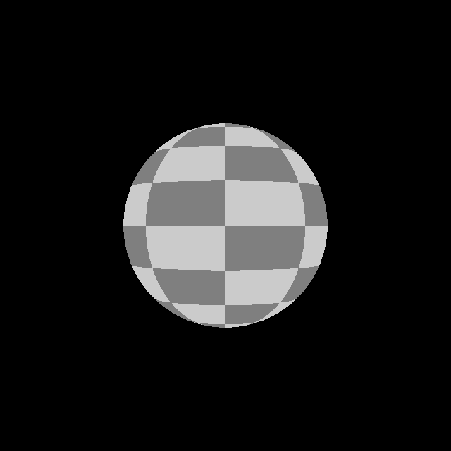
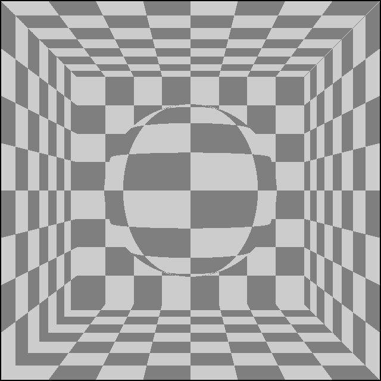

# UV coordinates in my ray tracer

Last time on my ray tracer journey I made a simple C++20 program that could trace rays from a camera and test if they intersect with a circle.

This time I want to make the scene a bit more interesting.

## UV coordinates of a Sphere

When a ray hits a sphere we can use some simple trigonometry to find the intersection point's Uv coordinates on the sphere.
Again, I will just link to [Scratch a Pixel](https://www.scratchapixel.com/lessons/3d-basic-rendering/minimal-ray-tracer-rendering-simple-shapes/ray-sphere-intersection.html) instead of repeating the math.

Let's add a `uv` member to the `Intersection` class:
```C++
struct Intersection
{
    ...
    Vec2 uv;
};
```

To be able to visualize the UV coordinates I calculate a checker pattern:
```C++
Vec4 checkerPattern(
    const Vec2 &uv, 
    const int checker_count, 
    const Vec4 dark, 
    const Vec4 bright
){
    const auto checker_x = int(uv.x * checker_count) % 2;
    const auto checker_y = int(uv.y * checker_count) % 2;

    const float checker = checker_x ^ checker_y;

    return bright * checker + dark * (1-checker);
}
```

Then I can update the colorization code to use the checker pattern:
```C++
const auto darkChecker = Vec4{0.5,0.5,0.5,0};
const auto lightChecker = Vec4{0.8,0.8,0.8,0};

if (intersection.has_value())
{
    const auto checker = checkerPattern(intersection->uv, 8, darkChecker, lightChecker);

    setPixel(x, y, checker);
}
```

Running the updated code results in this checker patter on the sphere:



## Square and Object

Spheres are great but I decided it would be nice to have more variety in the scene, so next up is adding squares.

```C++
struct Square
{
    Vec3 p;
    Vec3 n;
    Vec3 right;
    float size;
};
```

A square is described by its center, normal vector, tangential vector (I called it `right`) and size.

Computing the intersection between a square and a ray should be easy, so I also omit the math for that. There are many sources detailing it online.

The interface for the intersection testing is then:
```C++
std::optional<Intersection> getIntersection(const Ray &ray, const Square &square);
```

Now I would like to be able to handle squares and circles in a generic way so I introduce an abstraction, objects:
```C++
using Object = std::variant<Circle, Square>;
```

Using `std::variant` over virtual inheritance has the advantage of not needing dynamic allocation and easier to use in GPU code later.

Later if I add more object types I can just extend this definition.

To dispatch an intersection call to the correct type contained in the variant I use `std::visit`:
```C++
const Object obj = ...;

const auto intersection = std::visit([&](auto&& o) {return getIntersection(ray, o);}, obj);
```

## Rendering many objects

Let's replace our single sphere with a list of objects:
```C++
std::vector<Object> objects;

objects.emplace_back(Square{
    .p = Vec3{0,0,2.5},
    .n = Vec3{0,0,-1},
    .right = Vec3{1,0,0},
    .size = 1,
});

...
```

Let's factor out the ray casting from the rendering, while making sure to find the closest intersection:
```C++
std::optional<Intersection> cast(const Ray &ray)
{
    std::optional<Intersection> best = std::nullopt;

    for (const auto &obj : objects)
    {
        const auto intersection = std::visit([&](auto&& o) {return getIntersection(ray, o);}, obj);

        if (!intersection.has_value()) continue;
        
        if (!best.has_value() || best->t > intersection->t)
        {
            best = intersection;
        }
    }

    return best;
}
```

Putting it all together yields a render of a checkerboard room:


This time I introduced a new abstraction to be bale to handle different kinds of objects. I also extended the renderer with squares.
Next up I will introduce basic materials to the renderer.
