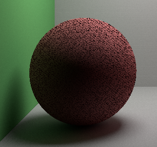
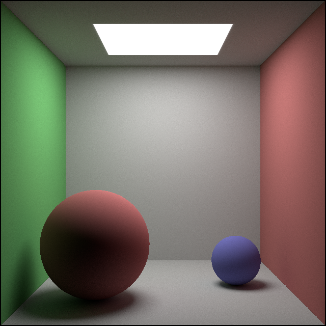

# Forward path tracing

Previously I created a ray tracing program that can render colored shapes with a checkerboard texture.

It's finally time to actually do computer graphics and add path tracing to my application.

## The rendering equation

In its most glorious form the rendering equation looks like this:

$L_o(\bold{x}, \omega_o, \lambda, t) = L_e(\bold{x}, \omega_o, \lambda, t) + L_r(\bold{x}, \omega_o, \lambda, t)$

$L_r(\bold{x}, \omega_o, \lambda, t) = \int_\Omega{f_r(x,\omega_i,\omega_o,\lambda,t)L_i(\bold{x}, \omega_i, \lambda, t)(\omega_i\cdot \bold{n})}d\omega_i$

Where

$L_o$ is the total outgoing light of wavelength $\lambda$, from point $\bold{x}$ towards direction $\omega_o$ at time $t$ \
$L_e$ is the emitted light with the same parameters as $L_o$ \
$L_r$ is the reflected light with the same parameters as $L_o$ \
$L_r$ is the incoming light of wavelength $\lambda$, to point $\bold{x}$ from direction $\omega_i$ at time $t$ \
$f_r$ is the bidirectional ray distribution function, it describes how much light is reflected from direction to another \
$\bold{n}$ is the normal of the surface at $\bold{x}$ \
$\Omega$ is the normal oriented hemisphere

This of course does not include volumetric and refractive effects.

## Simplifications

Luckily (or rather sadly) I only want simple diffuse surfaces and a light source for now. To simulate purely diffuse materials we can ignore $\lambda$ and $t$.

To produce color images I use 3 different reflectance values to produce red, green and blue linear color values. This is a reasonable approximation given that all wavelengths take the same path through the scene.

Furthermore because I only care about diffuse materials for now, $f_r$ does not depend on $\omega_o$ and $\omega_o$, $L_e$ and $L_r$ does not depend on $\omega_o$.

This simplifies the equations to:

$L_o(\bold{x}) = L_e(\bold{x}) + L_r(\bold{x})$

$L_r(\bold{x}) = \int_\Omega{f_r(x)L_i(\bold{x}, \omega_i)(\omega_i\cdot \bold{n})}d\omega_i$

## Monte Carlo 

The emission is simply a parameter of the material, but the reflected light's integral has to be numerically approximated. I use a basic Monte Carlo integration for that.

$L_r(\bold{x}) = \sum^N f_r(x) L_i(\bold{x}, \bold{d}_i)P^{-1}(\bold{d}_i)(\omega_i\cdot \bold{n})$

Where $d_i \sim H$ and $H$ is a uniform distribution on the hemisphere oriented towards $\bold{n}$. The summation is normalized using the probability density function $P(\bold{d}_i)$ short for $P(H=\bold{d}_i)$.

## Material extension

The material class gets two new members to encode emission and diffuse reflectance:
```C++
struct Material
{
    ...
    Vec4 emission;
    Vec4 diffuse_reflectance;
};
```

I set the values to mimic the [Cornell Box](https://en.wikipedia.org/wiki/Cornell_box) closely.

## Path tracing code

The actual code for forward path tracing is surprisingly simple. Instead of casting a single ray, I have maximum depth (4 is more than enough for the Cornell Box) and when the ray hits an object I generate a new direction to send the ray to.

During this iteration I keep track of the total transmittance and when the ray misses or the maximum depth limit is reached I simply terminate the loop. This introduces some small bias but as long as the allowed depth is large enough it should not matter.
```C++
auto ray = cameraRay(camera, Vec2{x, y});
Vec4 total_transmission{1,1,1,0};

for (int depth=0;depth<max_depth;++depth)
{
    const auto intersection = cast(ray);
    
    if (!intersection.has_value()) break;

    const auto &material = *intersection->mat;

    pixel_intensity = pixel_intensity + material.emission * total_transmission;

    const auto new_v = uniformHemisphereSample(intersection->n);

    const auto weakening_factor = dot(intersection->n, new_v);
    total_transmission = total_transmission * weakening_factor * material.diffuse_reflectance;

    ray = Ray{
        .p = intersection->p,
        .v = new_v
    };
}
```

To accumulating the gathered light I switched to using a float array, then scale it and quantize it when saving as an image.

This produces very nice images already, except for the shadow acne:


Thanks to limited numeric precision, the intersection point ends up inside the sphere and then does not accumulate any light.

Luckily there is a simple fix for this, just displace the ray off the surface before each trace by a small amount:
```C++
ray.p = ray.p + intersection->n * 1e-5;
```

The result looks beautiful:


Effects like soft shadows, diffuse reflectance, and ambient occlusion naturally emerge from such simple code.

I worked on classical rasterization CG projects before and it just feels unreal how much this simple technique can simulate.

The downside is of course computational demand, this image took 50'000 ray casts per pixel to generate and still has some noise.

## Bounce images

I had a fun idea, since I know the number of bounces (depth), why not look at how this image looks like if we restrict the light contribution to only a certain depth?


Interesting to see how the 2nd bounce really increases detail, how the subsequent bounces fade away and how every odd bounce leaks a bit more light above the "lamp".

This got me thinking, it would be so interesting to create a room in reality with a lamp that has an invisible emission spectrum, but then the objects are made from a material that re-emits visible light, or even somehow make the light visible after two or more bounces.
